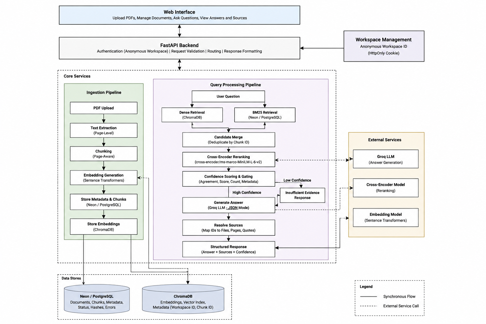
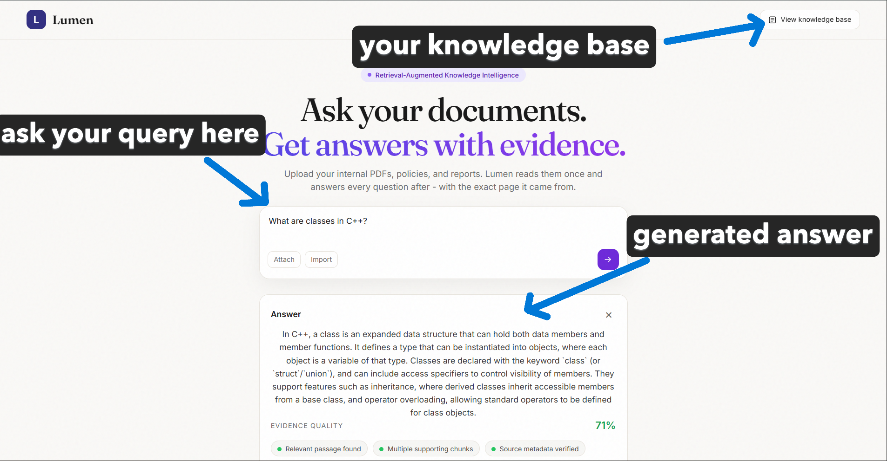
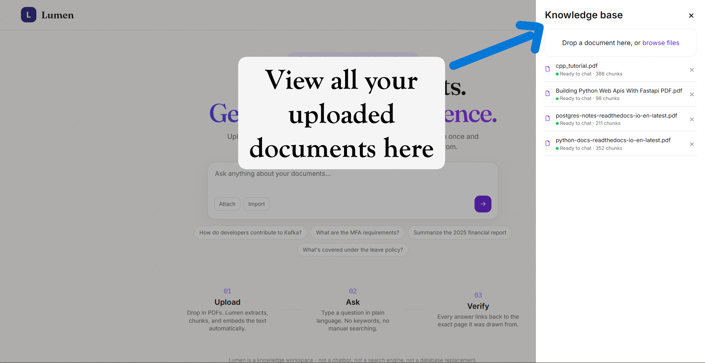

# Lumen

Lumen is a document intelligence platform that turns uploaded PDFs into an evidence-grounded question-answering system. It combines hybrid retrieval, cross-encoder reranking, confidence gating, and structured LLM responses so answers are tied to the user's uploaded documents rather than unsupported general knowledge.


## Architecture



## Demo

[Video demo](https://youtu.be/8_uhYJS3Mlo)






## System Workflow

- Upload individual PDFs or import a folder of PDFs from the web interface.
- Parse PDF text with page-level metadata.
- Persist document metadata and extracted chunks in PostgreSQL-compatible Neon.
- Persist embeddings and searchable vector metadata in ChromaDB.
- Combine semantic vector retrieval with BM25 keyword retrieval.
- Rerank candidate evidence with `cross-encoder/ms-marco-MiniLM-L-6-v2`.
- Refuse to answer when evidence confidence is below the configured threshold.
- Generate strict JSON responses with answer text and source IDs through Groq.
- Display source filenames and page numbers with each answer.
- Isolate documents by anonymous browser workspace to prevent cross-user knowledge-base leakage.


## System Components

| Component | Responsibility |
|---|---|
| FastAPI | HTTP API, request validation, dependency injection, and static frontend serving |
| Neon / PostgreSQL | Documents, page-aware chunks, statuses, hashes, and processing errors |
| ChromaDB | Persistent embeddings and vector metadata for semantic search |
| Sentence Transformers | Dense embeddings and cross-encoder reranking |
| BM25 | Keyword retrieval over workspace-scoped chunks |
| Groq | Evidence-grounded answer generation using structured JSON output |
| Vanilla JavaScript frontend | Upload, folder import, document management, querying, and evidence display |
| Alembic | Versioned schema migrations |
| Docker Compose | Reproducible local and deployment runtime |

## Retrieval And Generation Pipeline

### Ingestion

1. Validate that the upload is a PDF.
2. Save the file with a generated prefix to avoid filename collisions.
3. Calculate a content hash for workspace-local deduplication.
4. Extract text while preserving page numbers.
5. Split pages into retrieval chunks.
6. Store chunks and metadata in Neon.
7. Generate normalized embeddings.
8. Store vectors in the persistent Chroma collection.

### Retrieval

Lumen performs two searches for each question:

- Dense retrieval finds semantically similar chunks in Chroma.
- BM25 finds lexical matches across the current workspace's Neon chunks.

The results are merged by stable document/chunk IDs. A cross-encoder then scores the question and candidate passage together, and only the highest-scoring evidence is passed forward.

### Answer Generation

The confidence service combines:

- Retrieval agreement between vector and BM25 search.
- Top reranker score.
- Number of supporting chunks.
- Presence of filename and page metadata.

If confidence is below `0.45`, Lumen returns an explicit insufficient-evidence response without calling the LLM. Otherwise, the selected context is sent to Groq, which must return strict JSON containing an answer and source IDs. Source IDs are resolved back to filenames, pages, and quotes before the API response is returned.

## Privacy And Workspace Isolation

Lumen uses an anonymous browser workspace for the current deployment model. On a new browser session, the server issues an HttpOnly `lumen_workspace_id` cookie. The workspace ID is stored with documents, chunks, and Chroma metadata.

All of the following operations are scoped to that workspace:

- Document upload and duplicate detection.
- Document listing, status polling, and deletion.
- BM25 retrieval.
- Chroma vector retrieval.
- Answer generation context.

This prevents documents uploaded by one browser from appearing in another browser's knowledge base. It is browser-level isolation, not account-level identity. For persistent cross-device workspaces, organizations, or user access control, replace the anonymous cookie with an authenticated user or tenant identity derived from a trusted token.

## Engineering Decisions

The major design decisions are recorded in [DECISIONS.md](DECISIONS.md). The most important one is retaining cross-encoder reranking after evaluation showed a meaningful improvement in faithfulness. Lumen accepts a small decrease in answer relevancy because evidence support and factual grounding are higher-risk concerns for an enterprise knowledge tool.

Other implementation decisions:

- **Hybrid retrieval:** semantic search handles paraphrases while BM25 preserves exact keyword matching.
- **Page-aware chunks:** page metadata makes citations useful and auditable.
- **Confidence gating:** unsupported questions are refused instead of being passed to the generator.
- **Structured generation:** strict JSON makes answer parsing and citation mapping deterministic.
- **Anonymous workspace cookies:** this provides the smallest practical isolation model without adding account management.
- **Persistent Chroma:** embeddings survive application restarts and are mounted as a deployment volume.
- **Alembic migrations:** schema changes are applied explicitly during container startup.

## Evaluation

The evaluation dataset contains 40 questions across 5 documents:

- 45 answerable questions.
- 5 unanswerable questions.

The reranking experiment compared baseline hybrid retrieval against hybrid retrieval followed by cross-encoder reranking:

| Metric | Baseline | Reranked | Change |
|---|---:|---:|---:|
| Faithfulness | 0.624 | 0.735 | +0.111 |
| Answer relevancy | 0.795 | 0.735 | -0.060 |
| Context precision | 0.756 | 0.762 | +0.006 |
| Refusal accuracy | - | 1.000 | - |

The experiment selected hybrid retrieval plus reranking because faithfulness improved by `0.111`, while refusal accuracy reached `1.0`. The lower answer-relevancy score is an accepted tradeoff: Lumen prioritizes answers that are supported by retrieved evidence over answers that are merely broad or fluent.

Evaluation artifacts and runners are available under [app/evaluation](app/evaluation), with the decision record in [DECISIONS.md](DECISIONS.md).

## API Surface

| Method | Endpoint | Purpose |
|---|---|---|
| `GET` | `/health` | Service health information |
| `POST` | `/documents/upload` | Upload and index one PDF |
| `GET` | `/documents` | List documents in the current workspace |
| `GET` | `/documents/{document_id}` | Read document processing status |
| `DELETE` | `/documents/{document_id}` | Delete a document, its chunks, and its vectors |
| `POST` | `/query/` | Retrieve evidence and generate an answer |

Interactive API documentation is available at `/docs` when the service is running.

## Project Structure

```text
app/
	api/          FastAPI routes
	core/         Configuration, logging, workspace identity
	db/           SQLAlchemy base, session, and dependencies
	evaluation/   Datasets, runners, metrics, and results
	frontend/     HTML, CSS, JavaScript, and browser assets
	models/       Neon document and chunk models
	schemas/      Request and response contracts
	services/     Ingestion, retrieval, reranking, generation, and citations
	vectorstore/  Chroma client configuration
alembic/        Versioned database migrations
assets/         Project documentation assets
tests/          Automated tests
```

## Local Development

### Prerequisites

- Python 3.10 or newer.
- Docker and Docker Compose, recommended for the full runtime.
- A PostgreSQL-compatible Neon database.
- Groq API credentials.
- Hugging Face access for the embedding and reranker models.

### Environment

Copy the example environment file and fill in the required values:

```powershell
Copy-Item .env.example .env
```

Required settings include `DATABASE_URL`, `CHROMA_PATH`, `UPLOAD_DIR`, `GROQ_API_KEY`, `GROQ_MODEL`, and `HF_TOKEN`. Never commit `.env` or expose secrets in logs, screenshots, or repository history.

### Run With Docker

```powershell
docker compose build
docker compose up -d
docker compose logs -f lumen
```

Open `http://localhost:8000` after the embedding model finishes loading. The container runs `alembic upgrade head` before starting Uvicorn.

### Run Locally

```powershell
python -m venv venv
.\venv\Scripts\Activate.ps1
pip install -r requirements.txt
alembic upgrade head
uvicorn app.main:app --reload
```

## Database And Storage

Neon stores structured application data and extracted chunk text. Chroma stores vector embeddings and retrieval metadata. Uploaded PDFs are stored in `UPLOAD_DIR`, and the local persistent Chroma database is stored in `CHROMA_PATH`.

Do not delete Neon rows without also deleting their Chroma vectors. The document deletion service removes the uploaded file, Neon chunks, document metadata, and matching Chroma vectors together.

## Testing And Validation

Run the available tests with:

```powershell
pytest -q
```

Useful targeted checks:

```powershell
python -m compileall -q app alembic
node --check app/frontend/static/script.js
docker compose config
```

The health test currently reflects an older response contract and expects `{"status": "healthy"}`, while the application returns status, application, and version metadata. Update that test contract before treating the full test suite as green.

## Failure Analysis And Operational Notes

- **Structured JSON generation failure:** GPT-OSS can spend completion budget on reasoning before emitting JSON. Lumen uses low reasoning effort and a larger completion budget to reduce `json_validate_failed` errors.
- **Migration history mismatch:** Databases originally created with `create_tables.py` may have columns but no `alembic_version` table. Stamp the database at the matching existing revision before applying newer migrations.
- **Model startup time:** Sentence Transformer models load during application startup, so the port may be unavailable briefly after container launch.
- **Retrieval refusal:** A low-confidence result is an intentional refusal, not necessarily an ingestion failure. Check document status, chunk counts, and metadata before debugging the LLM.
- **Source deletion:** Deleting a document is global only within the current workspace and removes its file, Neon records, and Chroma vectors.


## Future Production Extensions

- Authenticated user and organization workspaces for cross-device access control.
- Background processing and observability for larger ingestion workloads.
- Streaming responses and expanded evaluation coverage for production traffic.

## License

Please review the license in [LICENSE](LICENSE) file.
